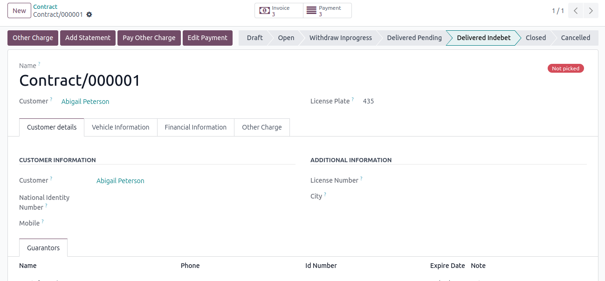
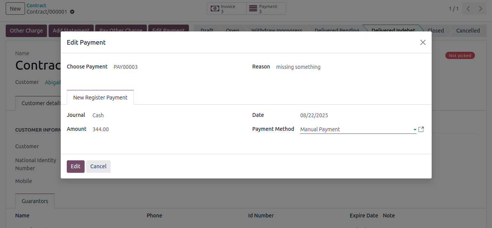
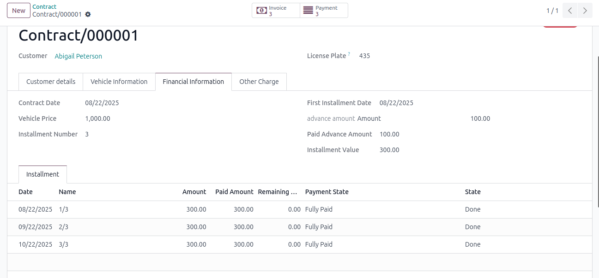

# Contract Ending With Ownership

## Screenshots

## Overview

This addon extends Odoo ERP to manage and track car rental agreements with installment payments, leading
to ownership transfer upon completion. It handles rental contracts, payment schedules, installment tracking,
and ownership transfer processes, ensuring seamless operations for car rental businesses.

#### Features

1.Visa Application Management

Create and manage visa applications with details  such as applicant name, visa type, purpose, and  validity period.

Support multiple visa categories (e.g., work, business, tourist) with customizable fields.

Store supporting documents (e.g., passports, invitation letters) linked to each application.

2.Transaction Processing

Record visa-related payments, including application fees, service charges, and expedited processing costs.

Integrate with payment gateways to process transactions securely (e.g., credit card payments via Stripe or PayPal).

Track payment status (e.g., pending, completed, refunded) for each visa transaction.

3.Status Tracking and Notifications

Monitor visa application progress (e.g., submitted, under review, approved, rejected).

Send automated notifications to applicants and company staff via email or SMS for status updates, payment confirmations, or required actions.

Provide a timeline view of each visa application’s progress.

4.Financial Integration

Seamlessly integrate with Odoo Accounting to generate invoices for visa fees and record payments.

Categorize transactions for accounting purposes (e.g., visa revenue, processing costs).

Support multi-currency transactions for international visa applications.

5.Employee and Applicant Portal

Offer a self-service portal for employees or applicants to submit visa applications, upload documents, and view transaction details.

Allow users to track application status and download payment receipts.

Provide secure access with role-based permissions for applicants, HR, and finance teams.

6.Compliance and Reporting

Ensure compliance with visa regulations by maintaining audit trails of all transactions and application updates.

Generate reports on visa transaction volumes, approval rates, and processing times.

Export compliance reports in PDF or Excel formats for regulatory submissions or internal audits.

7.Workflow Automation

Automate repetitive tasks, such as sending reminders for document submission or payment deadlines.

Configure approval workflows for visa applications, involving HR, finance, or management as needed.

Integrate with calendar apps to schedule visa-related appointments (e.g., embassy visits).

## Installation

##### You have to set the odoo18 environment firs 

To install the Tender module, follow these steps:

You have to set the odoo18 environment firs 

Download the module from the GitHub repository.

Place the module folder in your Odoo addons directory (e.g., /path/to/odoo/addons).

Update the Odoo apps list:

In Odoo, navigate to Apps > Update Apps List.

Search for the contract_ending_with_ownership in the Apps menu and click Install.

